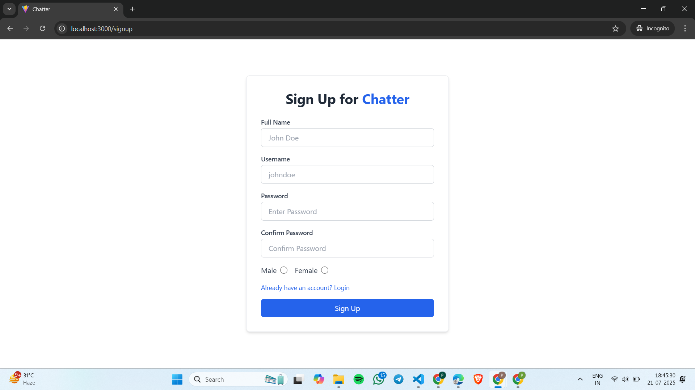
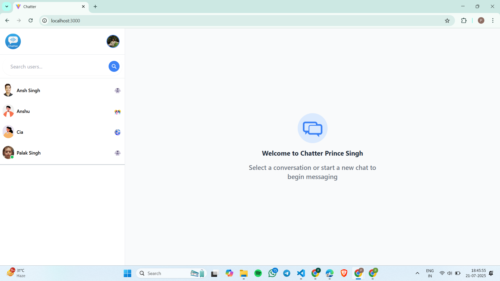
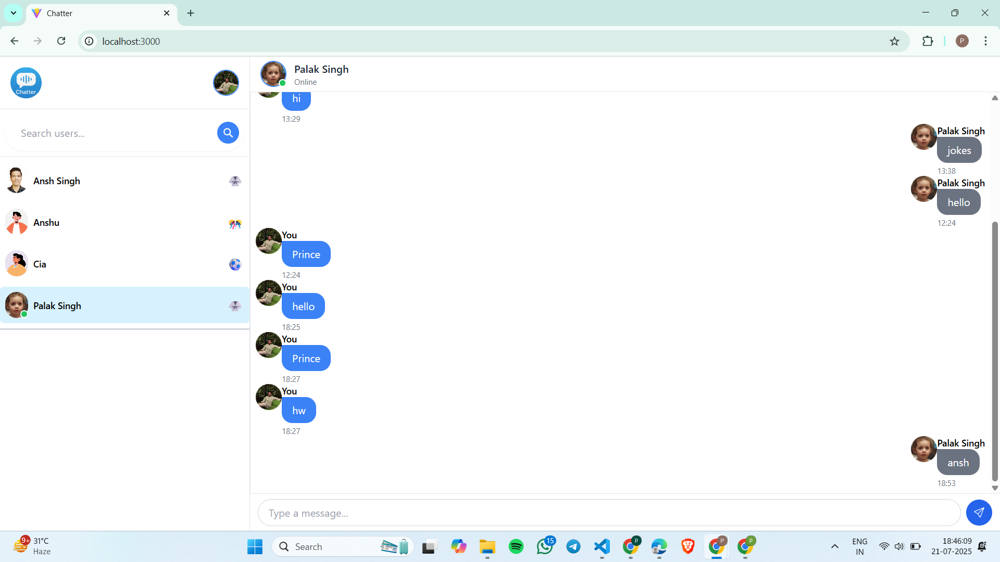
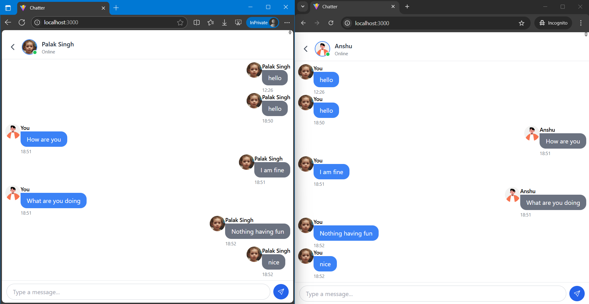

# 💬 Chatter - A MERN Stack ChatApp

**Chatter** is a powerful and responsive **real-time chat application** built using the **MERN Stack** (MongoDB, Express.js, React.js, Node.js). Chatter brings you modern messaging features, a sleek design, and cross-platform compatibility — making communication seamless and delightful.

---

## 📸 Updated Demo Snapshots

### 🔐 Login Page


### 📝 Register Page



### 💬 Chat Interface1



### 💬 Chat Interface2



### 📱 Real Time Chatting



---

## ✨ Features

* 🔐 JWT-based **Authentication** (Login / Register)
* 🧑‍🤝‍🧑 **One-on-One & Group Chats**
* 💬 **Real-time messaging** using **Socket.io**
* 🧠 **Intelligent UI** with message status indicators
* 📱 **Fully responsive design** for mobile, tablet, desktop

---

## 🛠️ Tech Stack

### Frontend

* React.js
* TailwindCSS
* Context API

### Backend

* Node.js
* Express.js
* MongoDB
* Socket.io
* JWT (JSON Web Token)

---

## 🚀 Getting Started

### 📥 Installation

```bash
# Clone the repo
https://github.com/your-username/chatter-chatapp.git

# Navigate to the project directory
cd chatter-chatapp

# Install server dependencies
npm install

# Navigate to client folder and install dependencies
cd client
npm install
```

### ▶️ Running the App

```bash
# From root folder, run backend
npm run server

# From /client folder, run frontend
npm start
```

---

## 🔐 Environment Variables

In the root `.env` file:

```env
PORT=5000
MONGO_URI=your_mongodb_connection_string
JWT_SECRET=your_jwt_secret_key
```

In the `client/.env` file:

```env
REACT_APP_SOCKET_URL=http://localhost:5000
```

---

## 🧩 Future Enhancements

* 📤 File & Media Sharing
* 📞 Voice and Video Calling
* 🔔 Push Notifications
* 🕓 Chat History Search
* 🧑‍🎨 User Avatars and Status
* ✉️ Unread Message Counters

---

## 📄 License

This project is licensed under the **MIT License**.

---


## 👤 Author

**Prince Singh**
GitHub: [@PrinceSingh1005](https://github.com/PrinceSingh1005)


> ⭐ If you find this project helpful, don’t forget to give it a star on GitHub!
